# Cloud-Based Real-Time Weather Forecasting Dashboard

A fully **cloud-hosted, serverless web application** that displays real-time weather data such as temperature, humidity, and wind speed for any city using the **OpenWeatherMap API**.  
Built with **React + Vite** for the frontend and **AWS Lambda + API Gateway** for the backend, hosted securely on **AWS S3** with HTTPS communication.

---

## Project Overview

This project demonstrates a complete **end-to-end cloud deployment** using AWS.  
Users can search for a city and instantly view live weather data fetched securely from OpenWeatherMap through an AWS Lambda function.

**Architecture:**

User → React Frontend (AWS S3)
→ HTTPS Request to AWS API Gateway
→ AWS Lambda (Python)
→ OpenWeatherMap API
→ JSON Response → UI

---

## Features

Real-time weather data (Temperature, Humidity, Wind Speed)  
Secure HTTPS communication between frontend and backend  
AWS serverless deployment (no EC2 or manual servers)  
Simple, scalable, and cost-efficient cloud architecture  

---

## Tools & Technologies

| Layer | Technology | Purpose |
|-------|-------------|----------|
| **Frontend** | React + Vite + TypeScript | Build responsive dashboard |
| **Backend** | AWS Lambda (Python) | Process and fetch API data |
| **API Gateway** | AWS | Expose secure HTTPS endpoint |
| **Database** | None (Stateless Real-time Fetch) | Reduced complexity |
| **Cloud Hosting** | AWS S3 (Frontend) | Static website hosting |
| **API Source** | OpenWeatherMap | Weather data provider |

---

## Architecture Diagram

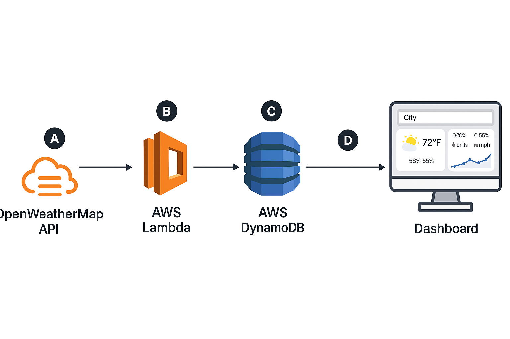

---

## Setup Steps

### Step 1 – Frontend (React + Vite)
1. Clone the repository  
   ```bash
   git clone https://github.com/Srini-0/cloud-weather-dashboard.git
   cd cloud-weather-dashboard/frontend
    ```
2. Install dependencies
  ```bash
  npm install
```
4. Add your environment file
   Create a .env file:
   ```bash
    VITE_API_BASE=https://q3sti5pug5.execute-api.us-east-1.amazonaws.com
    ```
6. Build the project
    ```bash
    npm run build
    ```
7. Upload the contents of dist/ to your AWS S3 bucket.
8. Enable Static Website Hosting and note the public URL.

---

### Screenshort:

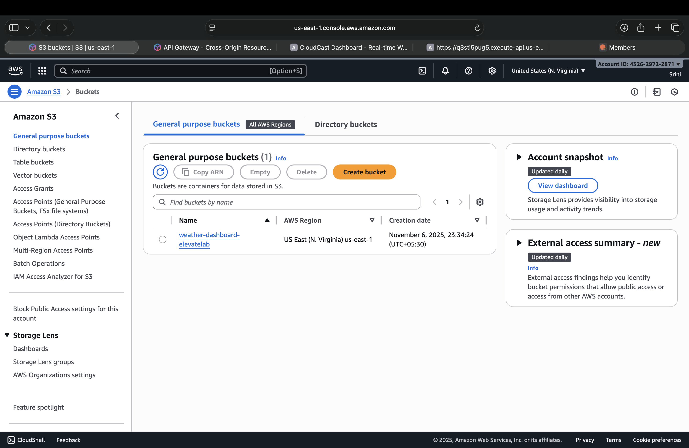
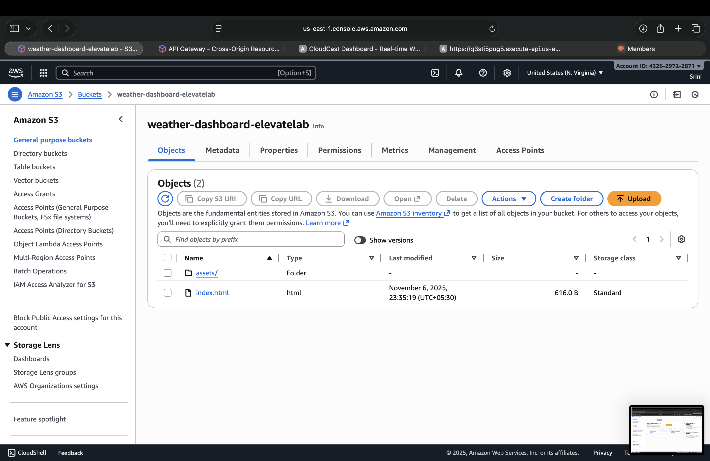
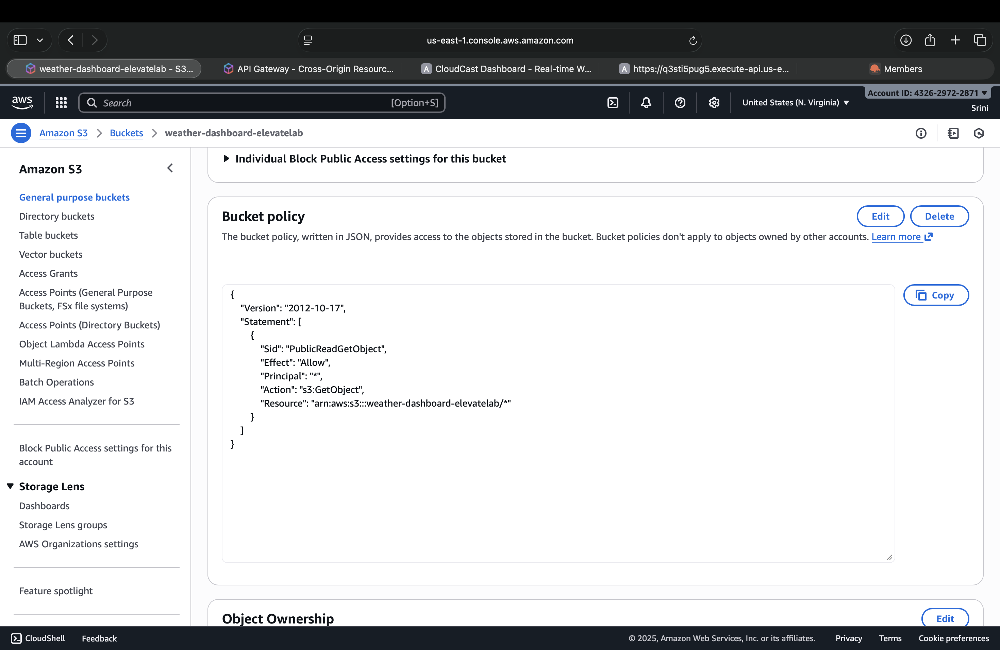


### Step 2 – Backend (AWS Lambda + API Gateway)

1. Create a new AWS Lambda function (Python 3.10)
2. Paste the code below:
  ```bash
import json
import os
import urllib.request

def lambda_handler(event, context):
    params = event.get("queryStringParameters") or {}
    city = params.get("city")
    api_key = os.environ.get("OPENWEATHER_API_KEY")

    if not city:
        return {"statusCode": 400, "body": json.dumps({"error": "City name required"})}

    url = f"https://api.openweathermap.org/data/2.5/weather?q={city}&appid={api_key}&units=metric"

    try:
        with urllib.request.urlopen(url) as response:
            data = json.loads(response.read().decode())
        return {
            "statusCode": 200,
            "headers": {"Content-Type": "application/json"},
            "body": json.dumps(data)
        }
    except Exception as e:
        return {"statusCode": 500, "body": json.dumps({"error": str(e)})}
```
3. Add Environment Variable:
   ```bash
    OPENWEATHER_API_KEY=your_api_key_here
    ```
4. Create an API Gateway (HTTP API)
    Route: /weather
    Integration: Lambda Function
    Enable CORS (Allow GET, Origin *)
5. Copy the Invoke URL (e.g. https://q3sti5pug5.execute-api.us-east-1.amazonaws.com).


### Screenshort:

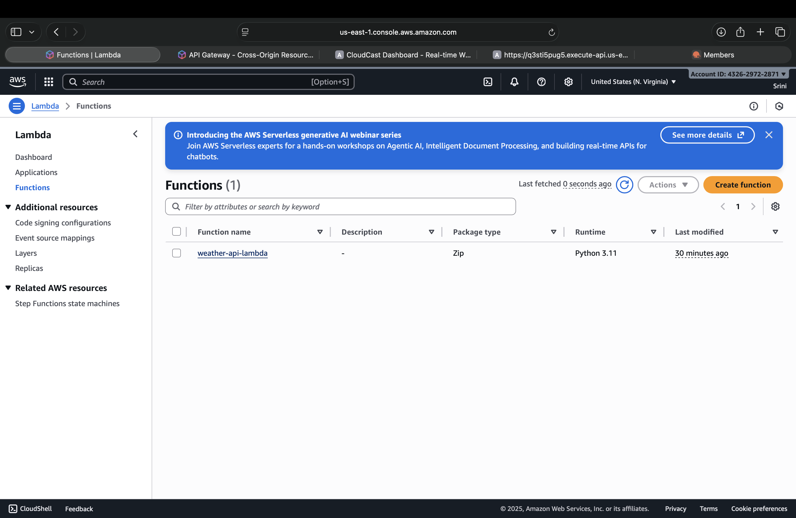
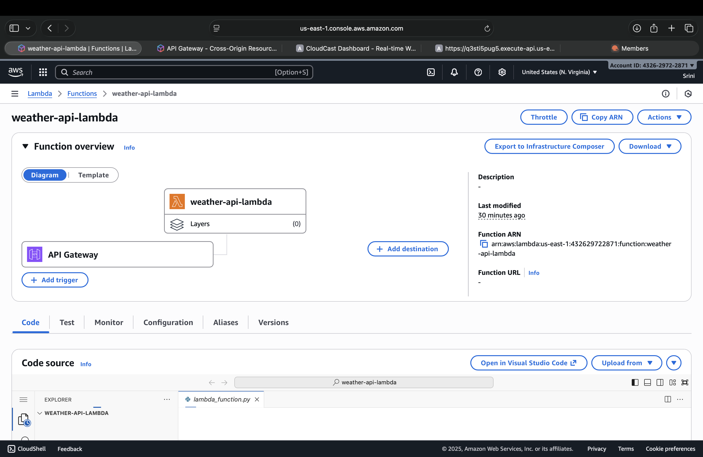
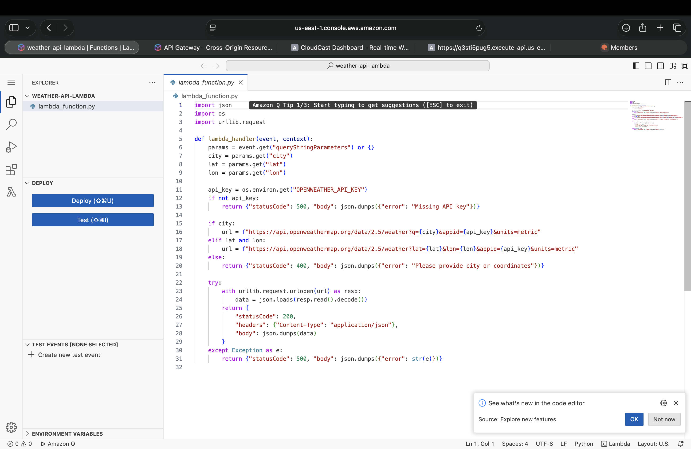
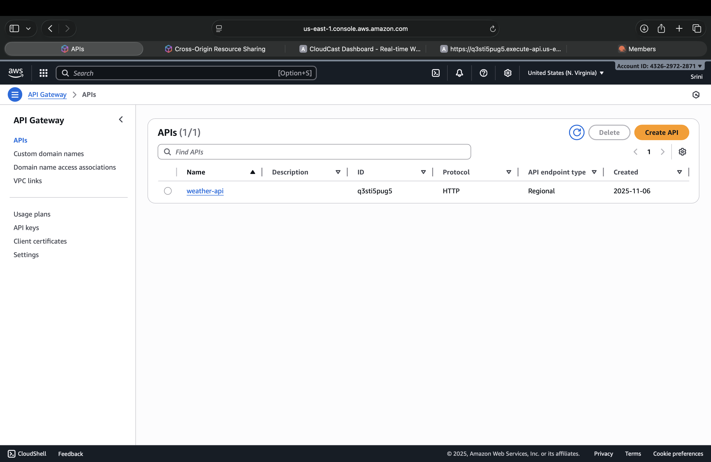
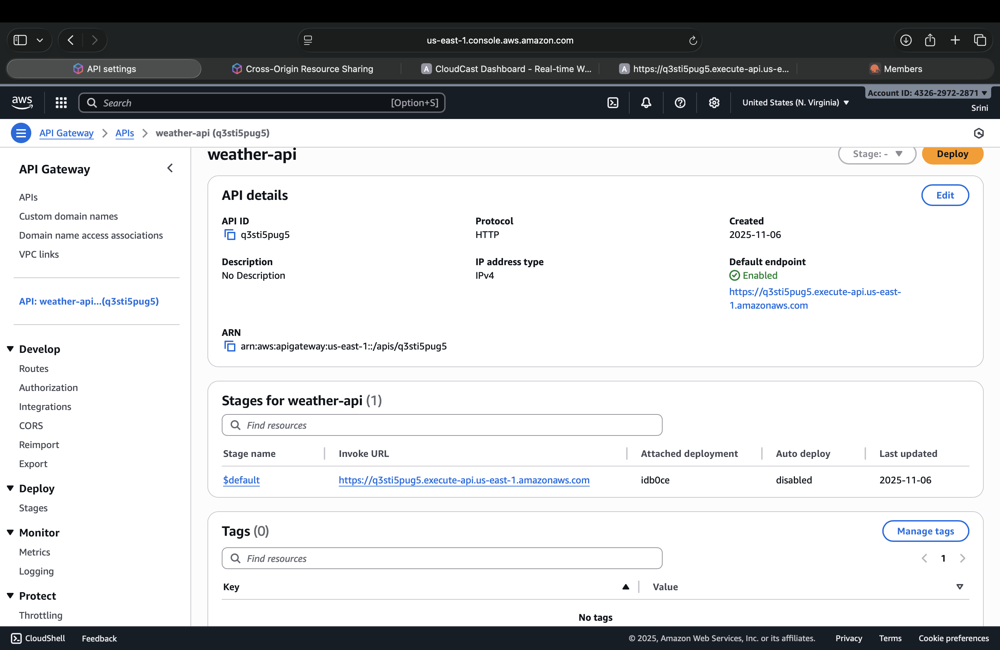
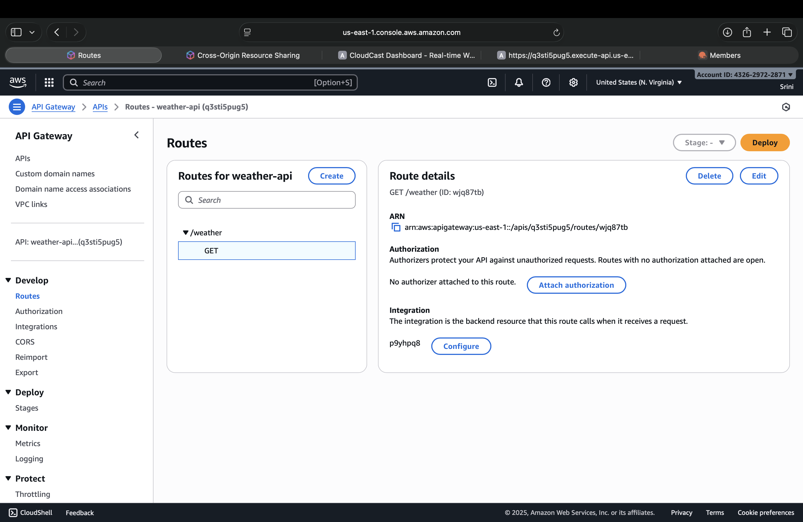
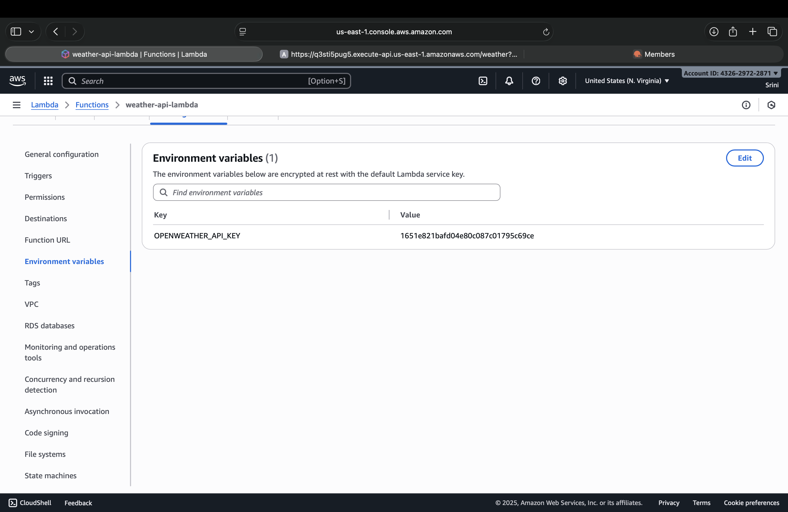
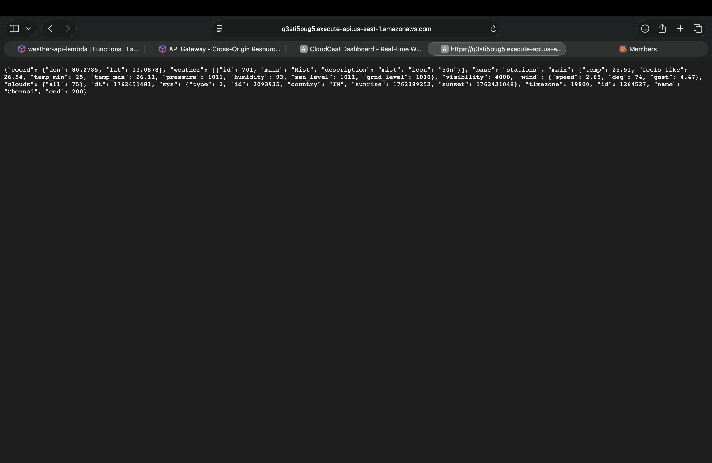


### Step 3 – Connect Frontend and Backend

1. In your .env file, replace:
  ```bash
    VITE_API_BASE=https://your-api-url.execute-api.us-east-1.amazonaws.com
  ```
2. Rebuild and re-upload your dist/ to S3.
Your application now connects securely via HTTPS!

### Screenshort:

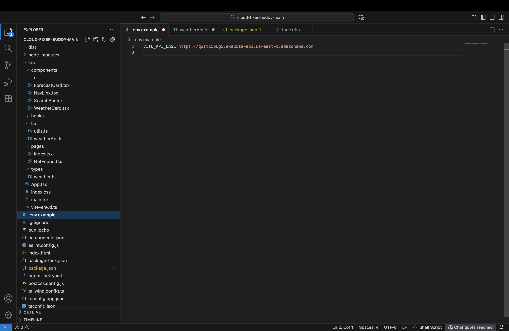

### step 4- Output Real-Time Weather Forecasting Dashboard

### Screenshort:

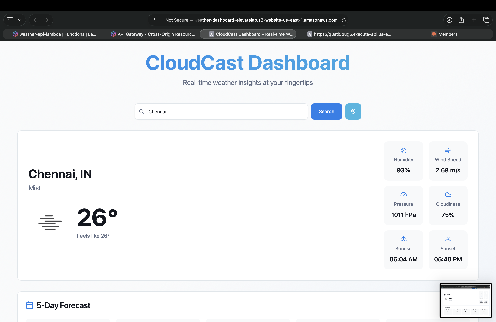
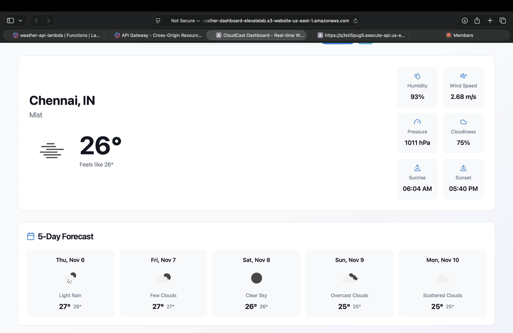


### Documentation Summary

Frontend: React + Vite hosted on S3
Backend: AWS Lambda + API Gateway
Connection: HTTPS (VITE_API_BASE endpoint)
OpenWeather API key: Securely stored in Lambda environment variable
Architecture: Stateless (no database)
